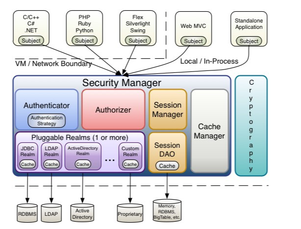

# 一、权限管理相关知识

- 数据的权限
- 资源的权限

## 1、认证

（1）登录方式的演进

- 账号密码
- 手机验证码/邮箱
- 第三方应用授权的登录
- 单点登录

（2）密码加密

## 2、权限管理

### （1）数据模型

- RABC理论基础
- 用户（用户组）
- 角色（角色组）
- 资源
  - 菜单
  - 按钮
  - 普通链接

**例子**：

deptId如何储存？

真实项目中，部门可能超级多，有人员变动等问题：离职、异动

性能问题：

- 小项目存储：递归（速度低）、parentId、fullName、path(/000/0001)
- 大项目：用es，数据量大，查询部门范围内的数据

### （2）范围大小

- 粗粒度
  - 菜单
  - 权限
  - 按钮
- 细粒度
  - 数据权限

# 二、shiro简介

[官网](https://shiro.apache.org/)



## 1、组成

**基础组件**

- Authentication：提供用户识别，也就是登录
- Authorization：访问控制，也就是授权
- Cryptography：自带加密算法保证数据安全
- Session Management：会话管理

特性：session信息，能在多线程代码中获取到

## 2、核心概念

**（1）Subject**

**（2）SecurityManager**

shiro核心组件，相当于SpringMVC中的的dispatcherServlet，管理subject，认证授权会话以及缓存的管理

- SessionManager：session管理
- SessionDAO：数据访问对象，如果分布式登录可扩展DAO接口
- CacheManager：缓存管理
- Cryptography：加密策略

**（3）Realms**

充当Shiro和应用程序安全数据之间的“桥梁”或“连接器”。也就是说，当需要与安全相关数据（如用户帐户）进行实际交互以执行身份验证（登录）和授权（访问控制）时，Shiro会从为应用程序配置的一个或多个Realms中查找其中的许多内容。

# 三、初级使用

## 1、基本名词

**Subject**：应用程序用户的特定安全用户 "视图"。它可以是一个人，一个第三方进程，一个连接到你的应用程序的服务器，甚至是一个cron作业。基本上，它可以是与你的应用程序通信的任何东西或任何人

**principals**：一个主体的识别属性

**credentials**：用于验证身份的秘密 数据。密码、生物识别数据证书等	

**Realms**：特定于安全的DAO、数据访问对象、与后端数据源对话的软件组件。如果你在 LDAP 中有用户名和密码，那么你将有一个 LDAP Realm 与 LDAP 通信。这个想法是，你将使用每个后端数据源的一个域，Shiro将知道如何与这些域一起协调，以完成你必须做的事情

## 2、认证

### （1）官网例子

1）shiro-quick-start.ini

```ini
[users]
system = system, user
admin = admin, admin
zhangsan = zhangsan ,user

[roles]
system = *
admin = user:*
user = user:insert
```

2）QuickStartShiro

```java
package test;

import lombok.extern.slf4j.Slf4j;
import org.apache.shiro.SecurityUtils;
import org.apache.shiro.authc.*;
import org.apache.shiro.mgt.DefaultSecurityManager;
import org.apache.shiro.realm.text.IniRealm;
import org.apache.shiro.session.Session;
import org.apache.shiro.subject.Subject;
import org.junit.jupiter.api.Test;

/**
 * <p>入门程序--登录，session存储角色，权限验证，退出</p>
 */
@Slf4j
public class QuickStartShiro {

    @Test
    public void test(){
        //1-初始化环境
        DefaultSecurityManager securityManager=new DefaultSecurityManager();
        IniRealm iniRealm=new IniRealm("classpath:shiro-quick-start.ini");
        securityManager.setRealm(iniRealm);
        //绑定当前 securityManager
        SecurityUtils.setSecurityManager(securityManager);
        // 2--获取当前用户信息
        Subject currentUser = SecurityUtils.getSubject();
        // 3-当前用户信息 操作一些事情--不需要web环境和其他容器支持
        Session session = currentUser.getSession();
        session.setAttribute("someKey", "value");
        String value = (String) session.getAttribute("someKey");
        if (value.equals("value")) {
            log.info("检测到 正确的 value 值! [" + value + "]");
        }
        // 4-当前用户登陆，检查角色和权限
        if (!currentUser.isAuthenticated()) {
            UsernamePasswordToken token = new UsernamePasswordToken("system", "system");
            token.setRememberMe(true);
            try {
                currentUser.login(token);
            } catch (UnknownAccountException uae) {
                log.info("无此用户，用户名： " + token.getPrincipal());
            } catch (IncorrectCredentialsException ice) {
                log.info("用户 " + token.getPrincipal() + " 登录密码不正确!");
            } catch (LockedAccountException lae) {
                log.info("用户名 " + token.getPrincipal() + " 被锁定.请联系管理员已解锁.");
            }
            // ... 系统自己定义的异常,系统提供了很多预制的异常，均 继承自 ShiroException或者起子类
            catch (AuthenticationException ae) {
                //unexpected condition?  error?
            }
        }
        //5 -验证
        log.info("用户 [" + currentUser.getPrincipal() + "] 登陆成功.");
        //6-测试角色
        if (currentUser.hasRole("system")) {
            log.info("拥有【system】角色!");
        } else {
            log.info("未拥有【system】角色!");
        }
        //5-测试权限码
        if (currentUser.isPermitted("user:update")) {
            log.info("拥有【user:update】权限.");
        } else {
            log.info("未拥有【user:update】权限..");
        }
        //6-退出
        currentUser.logout();
        System.exit(0);
    }
}

```

### （2）自定义realm

#### 1）单一realm

一般realm是要抛出异常的

MyRealm1:

```java
import org.apache.shiro.authc.*;
import org.apache.shiro.realm.Realm;

public class MyRealm1 implements Realm {

    // 注入用户service
    @Override
    public String getName() {
        return "myRealm1";
    }

    @Override
    public boolean supports(AuthenticationToken token) {
        return token instanceof UsernamePasswordToken;
    }

    @Override
    public AuthenticationInfo getAuthenticationInfo(AuthenticationToken token) throws AuthenticationException {
        //得到用户名
        String username = (String)token.getPrincipal();
        //得到密码
        String password = new String((char[])token.getCredentials());
        //如果用户名错误
        if(!"system".equals(username)) {
            throw new UnknownAccountException();
        }
        //如果密码错误
        if(!"system".equals(password)) {
            throw new IncorrectCredentialsException();
        }
        //如果身份认证验证成功，返回一个AuthenticationInfo实现；
        return new SimpleAuthenticationInfo(username, password, getName());
    }
}
```

test：

```java
@Test
public void testOneRealms(){
	DefaultSecurityManager securityManager=new DefaultSecurityManager();
	securityManager.setRealm(new MyRealm1());
	SecurityUtils.setSecurityManager(securityManager);
	// 1-获取当前用户信息
	Subject currentUser = SecurityUtils.getSubject();
	// 2-当前用户登陆
	if (!currentUser.isAuthenticated()) {
		UsernamePasswordToken token = new UsernamePasswordToken("system", "system");
		try {
			currentUser.login(token);
			log.info("登陆成功");
		} catch (UnknownAccountException uae) {
			log.info("无此用户，用户名： " + token.getPrincipal());
		} catch (IncorrectCredentialsException ice) {
			log.info("密码不正确 " + token.getPrincipal() + " was incorrect!");
		}
	}
	//3-退出
	currentUser.logout();
	System.exit(0);
}
```

#### 2）多个realm

使用多个realm的原因，用户登录方式可能有多种：用户名密码、邮箱、手机号、auth2

##### 1.认证策略

AuthenticationStrategy：

- **FirstSuccessfulStrategy**：只要有一个 Realm 验证成功即可，只返回第一个 Realm 身份验证成功的认证信息，其他的忽略
- **AtLeastOneSuccessfulStrategy**：只要有一个 Realm 验证成功即可，和 FirstSuccessfulStrategy 不同，返回所有 Realm 身份验证成功的认证信息；
- **AllSuccessfulStrategy**：所有 Realm 验证成功才算成功，且返回所有 Realm 身份验证成功的认证信息，如果有一个失败就失败了

ModularRealmAuthenticator 默认使用 AtLeastOneSuccessfulStrategy 策略。

##### 2.代码：

###### MyRealm1：

```java
import org.apache.shiro.authc.*;
import org.apache.shiro.realm.Realm;

public class MyRealm1 implements Realm {

    // 注入用户service
    @Override
    public String getName() {
        return "myRealm1";
    }

    @Override
    public boolean supports(AuthenticationToken token) {
        return token instanceof UsernamePasswordToken;
    }

    @Override
    public AuthenticationInfo getAuthenticationInfo(AuthenticationToken token) throws AuthenticationException {
        //得到用户名
        String username = (String)token.getPrincipal();
        //得到密码
        String password = new String((char[])token.getCredentials());
        //如果用户名错误
        if(!"system".equals(username)) {
            throw new UnknownAccountException();
        }
        //如果密码错误
        if(!"system".equals(password)) {
            throw new IncorrectCredentialsException();
        }
        //如果身份认证验证成功，返回一个AuthenticationInfo实现；
        return new SimpleAuthenticationInfo(username, password, getName());
    }
}
```

###### MyRealm2：

```java
import org.apache.shiro.authc.*;
import org.apache.shiro.realm.Realm;

public class MyRealm2 implements Realm {
    @Override
    public String getName() {
        return "myRealm2";
    }

    @Override
    public boolean supports(AuthenticationToken token) {
        return token instanceof UsernamePasswordToken;
    }

    @Override
    public AuthenticationInfo getAuthenticationInfo(AuthenticationToken token) throws AuthenticationException {
        //得到用户名
        String username = (String)token.getPrincipal();
        //得到密码
        String password = new String((char[])token.getCredentials());
        //如果用户名错误
        if(!"admin".equals(username)) {
            throw new UnknownAccountException();
        }
        //如果密码错误
        if(!"admin".equals(password)) {
            throw new IncorrectCredentialsException();
        }
        //如果身份认证验证成功，返回一个AuthenticationInfo实现；
        return new SimpleAuthenticationInfo(username, password, getName());
    }
}
```

###### MyRealm3：

```java
import org.apache.shiro.authc.*;
import org.apache.shiro.realm.Realm;

public class MyRealm3 implements Realm {
    @Override
    public String getName() {
        return "myRealm3";
    }

    @Override
    public boolean supports(AuthenticationToken token) {
        return token instanceof UsernamePasswordToken;
    }

    @Override
    public AuthenticationInfo getAuthenticationInfo(AuthenticationToken token) throws AuthenticationException {
        //得到用户名
        String username = (String)token.getPrincipal();
        //得到密码
        String password = new String((char[])token.getCredentials());
        //如果用户名错误
        if(!"zhangsan".equals(username)) {
            throw new UnknownAccountException();
        }
        //如果密码错误
        if(!"zhangsan".equals(password)) {
            throw new IncorrectCredentialsException();
        }
        //如果身份认证验证成功，返回一个AuthenticationInfo实现；
        return new SimpleAuthenticationInfo(username, password, getName());
    }
}
```

###### test:

```java
@Test
public void testMultiRealmsStrate(){
	DefaultSecurityManager securityManager=new DefaultSecurityManager();

	List<Realm> list = new ArrayList<>();
	list.add(new MyRealm1());
	list.add(new MyRealm2());
	list.add(new MyRealm3());

	// 设置策略
	ModularRealmAuthenticator authenticator = new ModularRealmAuthenticator();

	authenticator.setAuthenticationStrategy(new FirstSuccessfulStrategy());
//        authenticator.setAuthenticationStrategy(new AtLeastOneSuccessfulStrategy());
//        authenticator.setAuthenticationStrategy(new AllSuccessfulStrategy());

	authenticator.setRealms(list);
	securityManager.setAuthenticator(authenticator);

	SecurityUtils.setSecurityManager(securityManager);
	// 1-获取当前用户信息
	Subject currentUser = SecurityUtils.getSubject();
	// 2-当前用户登陆
	if (!currentUser.isAuthenticated()) {
		UsernamePasswordToken token = new UsernamePasswordToken("system", "system1");
		try {
			currentUser.login(token);
			PrincipalCollection principals = currentUser.getPrincipals();
			log.info("登陆成功:"+principals);
		} catch (UnknownAccountException uae) {
			log.info("无此用户，用户名： " + token.getPrincipal());
		} catch (IncorrectCredentialsException ice) {
			log.info("密码不正确 " + token.getPrincipal() + " was incorrect!");
		}
	}
	//3-退出
	currentUser.logout();
	System.exit(0);
}
```

### (3)、AuthorizingRealm

实际项目中使用该relm

CryptoRealm:

```java
import org.apache.shiro.authc.*;
import org.apache.shiro.authc.credential.CredentialsMatcher;
import org.apache.shiro.authc.credential.HashedCredentialsMatcher;
import org.apache.shiro.authz.AuthorizationInfo;
import org.apache.shiro.realm.AuthorizingRealm;
import org.apache.shiro.realm.Realm;
import org.apache.shiro.subject.PrincipalCollection;
import org.apache.shiro.util.ByteSource;

public class CryptoRealm extends AuthorizingRealm {


    @Override
    protected AuthorizationInfo doGetAuthorizationInfo(PrincipalCollection principals) {
        return null;
    }
    @Override
    protected AuthenticationInfo doGetAuthenticationInfo(AuthenticationToken token) throws AuthenticationException {
        //连接数据库
        String username = "admin";
        String password = "c657540d5b315892f950ff30e1394480";
        String salt = "salt";
        return new SimpleAuthenticationInfo(username, password, ByteSource.Util.bytes(salt), getName());
    }


    @Override
    public void setCredentialsMatcher(CredentialsMatcher credentialsMatcher) {
        HashedCredentialsMatcher shaCredentialsMatcher = new HashedCredentialsMatcher();

        shaCredentialsMatcher.setHashAlgorithmName("MD5");
        shaCredentialsMatcher.setHashIterations(1);
        shaCredentialsMatcher.setStoredCredentialsHexEncoded(true);
        super.setCredentialsMatcher(shaCredentialsMatcher);
    }
}

```

test:

```java
@Test
public void testCrypto() {
	DefaultSecurityManager securityManager = new DefaultSecurityManager();
	securityManager.setRealm(new CryptoRealm());
	SecurityUtils.setSecurityManager(securityManager);
	Subject subject = SecurityUtils.getSubject();
	UsernamePasswordToken token = new UsernamePasswordToken("admin", "admin1");
	subject.login(token);
	boolean authenticated = subject.isAuthenticated();
	if (authenticated) {
		System.out.println("登陆成功");
	}
}
```

## 3、加密

- Md5Hash
- SimpleHash

```java
import org.apache.shiro.crypto.hash.Md5Hash;
import org.apache.shiro.crypto.hash.SimpleHash;
import org.junit.jupiter.api.Test;

public class MD5Test {
    @Test
    public void testMD5(){
        String password = "admin";
        String salt = "salt";
        String result = new Md5Hash(password, salt, 1).toString();
        //c657540d5b315892f950ff30e1394480
        System.out.println(result);
    }
    @Test
    public void testSimpleHash() {
        String password = "admin";
        String salt = "salt";
        SimpleHash simpleHash = new SimpleHash("MD5", password, salt, 1);
        //c657540d5b315892f950ff30e1394480
        System.out.println(simpleHash.toString());
    }

}
```

## 4、授权

例子：

```java
import lombok.extern.slf4j.Slf4j;
import org.apache.shiro.SecurityUtils;
import org.apache.shiro.authc.*;
import org.apache.shiro.mgt.DefaultSecurityManager;
import org.apache.shiro.realm.text.IniRealm;
import org.apache.shiro.session.Session;
import org.apache.shiro.subject.Subject;
import org.junit.jupiter.api.Test;

@Slf4j
public class QuickStartShiro {

    @Test
    public void test(){
        //1-初始化环境
        DefaultSecurityManager securityManager=new DefaultSecurityManager();
        IniRealm iniRealm=new IniRealm("classpath:shiro-quick-start.ini");
        securityManager.setRealm(iniRealm);
        //绑定当前 securityManager
        SecurityUtils.setSecurityManager(securityManager);
        // 2--获取当前用户信息
        Subject subject = SecurityUtils.getSubject();
        // 3-当前用户信息 操作一些事情--不需要web环境和其他容器支持
        Session session = subject.getSession();
        session.setAttribute("someKey", "value");
        String value = (String) session.getAttribute("someKey");
        if (value.equals("value")) {
            log.info("检测到 正确的 value 值! [" + value + "]");
        }
        // 4-当前用户登陆，检查角色和权限
        if (!subject.isAuthenticated()) {
            UsernamePasswordToken token = new UsernamePasswordToken("system", "system");
            token.setRememberMe(true);
            try {
                subject.login(token);
            } catch (UnknownAccountException uae) {
                log.info("无此用户，用户名： " + token.getPrincipal());
            } catch (IncorrectCredentialsException ice) {
                log.info("用户 " + token.getPrincipal() + " 登录密码不正确!");
            } catch (LockedAccountException lae) {
                log.info("用户名 " + token.getPrincipal() + " 被锁定.请联系管理员已解锁.");
            }
            // ... 系统自己定义的异常,系统提供了很多预制的异常，均 继承自 ShiroException或者起子类
            catch (AuthenticationException ae) {
                //unexpected condition?  error?
            }
        }
        //5 -验证
        log.info("用户 [" + subject.getPrincipal() + "] 登陆成功.");
        //6-测试角色
        if (subject.hasRole("system")) {
            log.info("拥有【system】角色!");
        } else {
            log.info("未拥有【system】角色!");
        }
        //5-测试权限码
        if (subject.isPermitted("user:update")) {
            log.info("拥有【user:update】权限.");
        } else {
            log.info("未拥有【user:update】权限..");
        }
        //6-退出
        subject.logout();
        System.exit(0);
    }
}

```

运行结果：

```java
2021-10-25 15:01:29,984 [INFO] [main] o.apache.shiro.session.mgt.AbstractValidatingSessionManager [AbstractValidatingSessionManager.java : 233] Enabling session validation scheduler...
2021-10-25 15:01:30,344 [INFO] [main] test.QuickStartShiro [QuickStartShiro.java : 36] 检测到 正确的 value 值! [value]
2021-10-25 15:01:30,346 [INFO] [main] test.QuickStartShiro [QuickStartShiro.java : 57] 用户 [system] 登陆成功.
2021-10-25 15:01:30,346 [INFO] [main] test.QuickStartShiro [QuickStartShiro.java : 62] 未拥有【system】角色!
2021-10-25 15:01:30,347 [INFO] [main] test.QuickStartShiro [QuickStartShiro.java : 68] 未拥有【user:update】权限..
```


1:56:25

如果设置了rememberMe，不主动点击退出，直接关闭浏览器，下次进来就还是登录状态（客户端保存了cookie）

# 四、shiro源码

## 1、ShiroException

学习一个框架，可以从他的Exception看起，shiro所有异常都继承于该异常

```java
package org.apache.shiro;

public class ShiroException extends RuntimeException {
    public ShiroException() {
    }

    public ShiroException(String message) {
        super(message);
    }

    public ShiroException(Throwable cause) {
        super(cause);
    }

    public ShiroException(String message, Throwable cause) {
        super(message, cause);
    }
}
```

