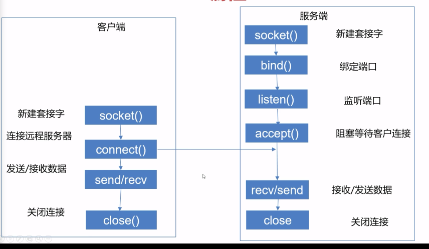

## 1、网络分层

TCP、UDP的却别，基于TCP、UD分别有什么协议？

TCP 是面向连接的，UDP 是面向无连接的

UDP程序结构较简单

TCP 是面向字节流的，UDP 是基于数据报的

TCP 保证数据正确性，UDP 可能丢包

TCP 保证数据顺序，UDP 不保证

 

tcp:SMTP、TELNET、HTTP、FTP

udp:DNS、TFTP（简单文件传输协议）、RIP（路由选择协议）、DHCP、BOOTP（是DHCP的前身）、IGMP（Internet组管理协议）

 

## **2、http和https的区别?**

端口：http:80；https:443;

域名系统DNS的解析过程

TCP UDP HTTP HTTPS 端口

 

## **3、tcp协议**

### **建立连接：三次握手**

（1）第一次握手：Client将标志位SYN置为1，随机产生一个值seq=J，并将该数据包发送给Server，Client进入SYN_SENT状态，等待Server确认。

（2）第二次握手：Server收到数据包后由标志位SYN=1知道Client请求建立连接，Server将标志位SYN和ACK都置为1，ack=J+1，随机产生一个值seq=K，并将该数据包发送给Client以确认连接请求，Server进入SYN_RCVD状态。

（3）第三次握手：Client收到确认后，检查ack是否为J+1，ACK是否为1，如果正确则将标志位ACK置为1，ack=K+1，并将该数据包发送给Server，Server检查ack是否为K+1，ACK是否为1，如果正确则连接建立成功，Client和Server进入ESTABLISHED状态，完成三次握手，随后Client与Server之间可以开始传输数据了。

### **关闭连接：四次挥手**

图3 TCP四次挥手

​    由于TCP连接时全双工的，因此，每个方向都必须要单独进行关闭，这一原则是当一方完成数据发送任务后，发送一个FIN来终止这一方向的连接，收到一个FIN只是意味着这一方向上没有数据流动了，即不会再收到数据了，但是在这个TCP连接上仍然能够发送数据，直到这一方向也发送了FIN。首先进行关闭的一方将执行主动关闭，而另一方则执行被动关闭，上图描述的即是如此。

​    （1）第一次挥手：Client发送一个FIN，用来关闭Client到Server的数据传送，Client进入FIN_WAIT_1状态。

​    （2）第二次挥手：Server收到FIN后，发送一个ACK给Client，确认序号为收到序号+1（与SYN相同，一个FIN占用一个序号），Server进入CLOSE_WAIT状态。

​    （3）第三次挥手：Server发送一个FIN，用来关闭Server到Client的数据传送，Server进入LAST_ACK状态。

​    （4）第四次挥手：Client收到FIN后，Client进入TIME_WAIT状态，接着发送一个ACK给Server，确认序号为收到序号+1，Server进入CLOSED状态，完成四次挥手。

保证可靠

socket是操作系统为了方便应用程序直接使用tcp协议而存在的一个抽象层

TCP：面向连接的、安全的；相比UPD更低效。

UDP：非面向连接的、不安全的；高效。

同一个协议下，端口可以冲突

端口：0~66535

https是http的升级版，安全协议

TCP：HTTP、SMTP、FTP

UDP：DNS、SNMP

 

socket中udp传输最多能传60k